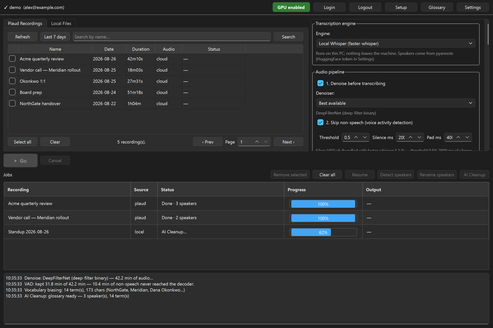
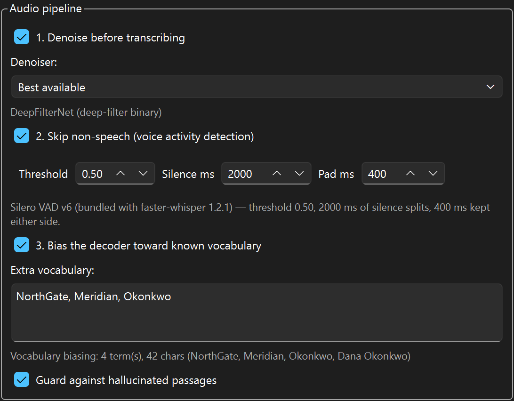
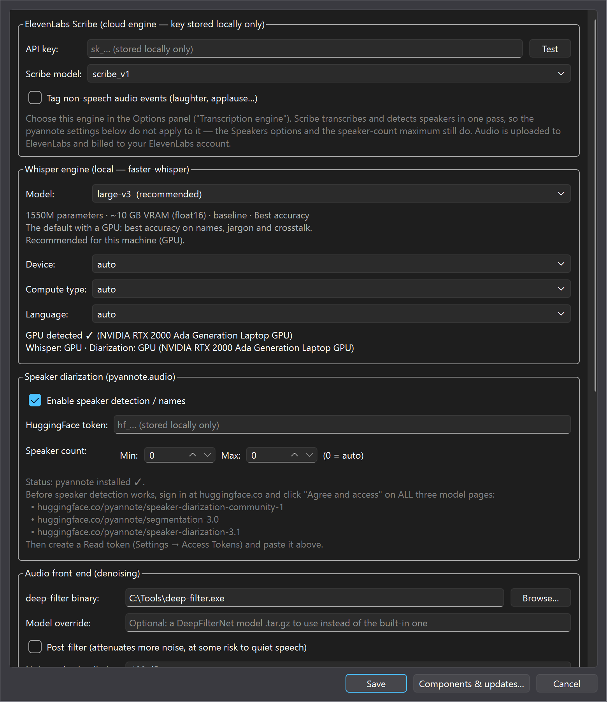
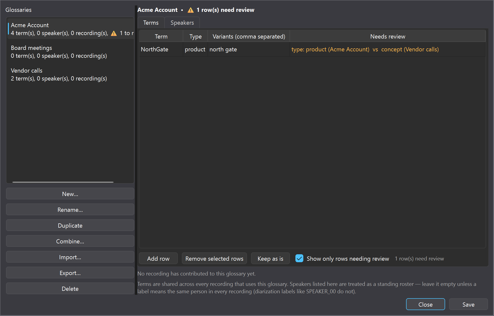
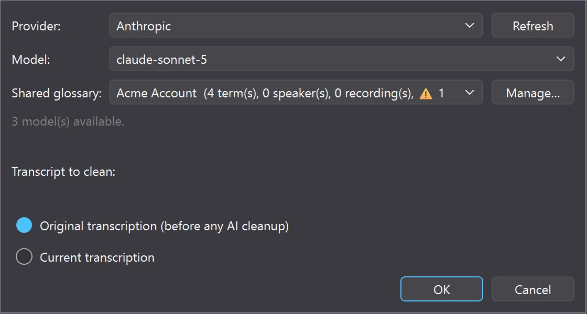
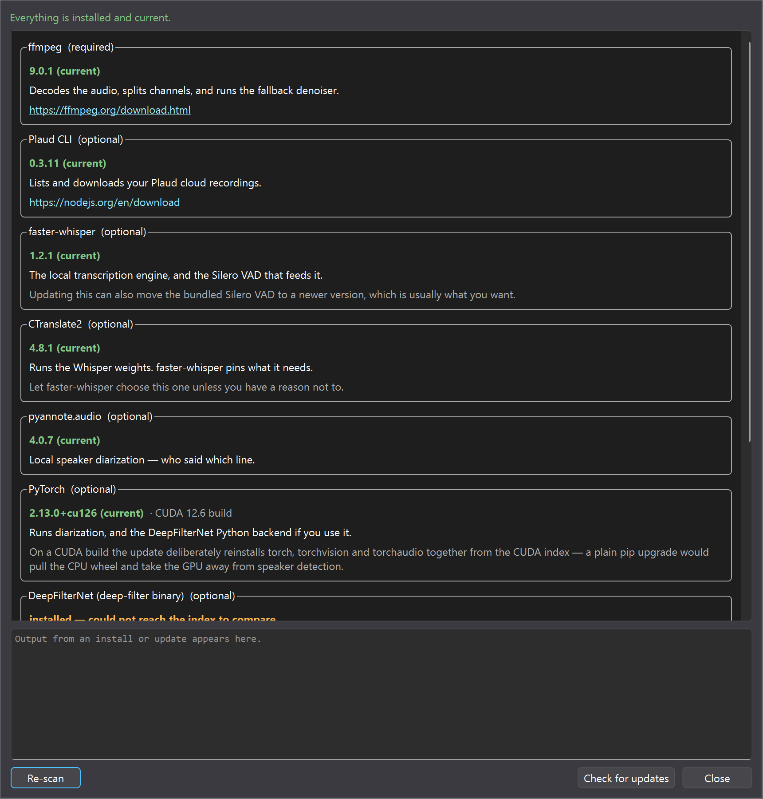

# Transcriber Studio

A desktop workbench that turns recordings into clean, speaker-labelled transcripts — on your own machine.

[](LICENSE)
[](https://www.python.org/downloads/)
[](#platform-support)
[](https://github.com/labatt/transcriber-studio/actions/workflows/tests.yml)

Most transcription tools give you one knob: which model. On hard audio — a noisy room, a table
mic, someone talking two tables over — the model is maybe a third of the result. This app is built
around the other two thirds: **what happens to the audio before the decoder sees it**, and **what
the decoder is told to expect**.



> ⚠️ **Windows 11 is the only platform this has been used in anger.** The test suite and the GUI
> both run on Ubuntu 24.04, but no real transcription has been done there and macOS has never been
> tried. See [Platform support](#platform-support) for the details.

> **Not affiliated with, endorsed by, or sponsored by PLAUD AI.** PLAUD is a trademark of its
> respective owner. This is an independent tool that can import from PLAUD cloud recorders using
> their public CLI, alongside ordinary local audio files.

---

## Contents

- [What it does](#what-it-does)
- [Platform support](#platform-support)
- [Requirements](#requirements)
- [GPU vs. no GPU](#gpu-vs-no-gpu)
- [Installation](#installation) — [Python](#1-python) · [the app](#2-the-app) ·
  [ffmpeg](#3-ffmpeg-required) · [denoiser](#4-the-denoiser-recommended) ·
  [GPU PyTorch](#5-pytorch-for-a-gpu-optional) · [diarization](#6-speaker-diarization-optional) ·
  [PLAUD](#7-plaud-cloud-import-optional)
- [First run](#first-run)
- [Your first transcription](#your-first-transcription)
- [Getting better results on hard audio](#getting-better-results-on-hard-audio)
- [Glossaries](#glossaries)
- [AI cleanup](#ai-cleanup)
- [Keeping it up to date](#keeping-it-up-to-date)
- [Models](#models)
- [Where your data lives](#where-your-data-lives)
- [Troubleshooting](#troubleshooting)
- [Development](#development)
- [Licensing](#licensing)

---

## What it does

**A three-layer front end, then the model.**



1. **Denoise** — [DeepFilterNet](https://github.com/Rikorose/DeepFilterNet) cleans the signal first.
   Whisper decodes noisy speech by leaning harder on its language prior, which is exactly when it
   starts inventing fluent text that was never said. Noise suppression is the cheapest accuracy in
   the pipeline.
2. **Voice activity detection** — Silero VAD (bundled with faster-whisper) cuts silence and
   non-speech so the decoder never sees it. This removes Whisper's worst failure mode at the
   source: hallucinating a paragraph over a quiet stretch.
3. **Vocabulary biasing** — names, product names and jargon are fed to the decoder as hotwords
   before it starts guessing at them. The words come from your **shared glossary**, which fills
   itself in as jobs run: what one recording taught the app, the next one already knows.

Then Whisper (or ElevenLabs Scribe) for the words, [pyannote](https://github.com/pyannote/pyannote-audio)
for who said them, and an optional LLM pass to turn fragments into readable prose.

Every layer reports what it actually did, and says so when it fell back to something weaker —
there is no configuration that quietly does nothing.

**Also in the box**

- **Shared glossaries** — named vocabularies several jobs read from and write back to.
- **AI cleanup** — merge fragments into sentences, fix speaker attribution, normalise terms
  against the glossary, and flag anything garbled.
- **Resume** — an interrupted job restarts from its last saved step. No re-transcription, no
  repeated model calls, no repeated spend.
- **Components window** — what's installed, what's newer, and buttons to update it.
- **Output formats** — `txt`, `srt`, `vtt`, `json`, `md`, with a filename template builder.

---

## Platform support

| | Status |
| --- | --- |
| **Windows 10/11** | **Used daily.** Where it is developed, and the only place real recordings have gone through it. |
| **Ubuntu 24.04** | **Runs.** Full test suite passes, and the GUI has been launched and rendered under Wayland (WSL2/WSLg). No transcription has actually been run, and no NVIDIA GPU was exercised. |
| macOS | **Never tried.** Nothing in the code should stop it, and there is no CUDA there — Whisper would be CPU-only, since CTranslate2 has no Metal backend. |

What is genuinely Windows-specific, all of it guarded so nothing crashes elsewhere:

- **PATH refresh from the registry** — a no-op off Windows, where it is not needed.
- **CUDA DLL directory registration** — a no-op off Windows.
- **"Run as administrator"** — Windows only. Elsewhere the app shows you the command to run with
  `sudo` rather than shipping a privilege-escalation path nobody has tested.
- **The `deep-filter` install instructions** name the release asset generically; pick the one for
  your platform.

Package installs are platform-aware (`winget` / `brew` / `apt-get`), and the data directory follows
each platform's convention — `%APPDATA%`, `$XDG_CONFIG_HOME`, or `~/Library/Application Support`.
Running on Linux is what turned up the last two portability bugs (a queue table hardcoded to dark
colours, and three tests that only passed on Windows), so if you use it on macOS or Linux, an
issue saying what broke would be genuinely useful.

---

## Requirements

|                    | Minimum                                  | Recommended                                   |
| ------------------ | ---------------------------------------- | --------------------------------------------- |
| OS                 | Windows 10                               | Windows 11                                     |
| Python             | 3.10                                     | 3.12 or 3.13                                   |
| RAM                | 8 GB                                     | 16 GB+                                         |
| Disk               | ~3 GB (small model + deps)               | ~15 GB (large-v3 + CUDA PyTorch)               |
| GPU                | none — CPU works                         | NVIDIA, 8 GB+ VRAM, driver 525+                |
| Required tool      | [ffmpeg](https://ffmpeg.org) on PATH     | + the `deep-filter` binary                     |

Nothing here needs a GPU, and nothing here needs an internet connection once the models are
downloaded — unless you deliberately choose a cloud engine or the LLM cleanup pass.

---

## GPU vs. no GPU

This is the decision that shapes everything else, so here it is plainly.

### With an NVIDIA GPU

Whisper `large-v3` runs several times faster than real time, and speaker detection runs on the GPU
too. This is the configuration the app is tuned for.

- **VRAM decides which model fits:** `large-v3` wants ~10 GB in float16, `medium` ~5 GB, `small`
  ~2 GB. With 8 GB you can usually still run `large-v3` if nothing else is on the card; the app
  falls back to CPU automatically if the GPU load fails, and says so in the log.
- **PyTorch must be a CUDA build.** `pip install torch` gives you the CPU one, and everything will
  appear to work while speaker detection crawls. See [step 5](#5-pytorch-for-a-gpu-optional).
- **CUDA 12 is deliberately preferred over CUDA 13,** because CTranslate2 — the engine that
  actually runs Whisper — is built against CUDA 12 and cuDNN 9.
- **Whisper and diarization are separate stacks.** Whisper runs on CTranslate2, diarization on
  PyTorch. It is entirely possible for one to be on the GPU and the other not, so Settings reports
  each device independently.

### Without a GPU

Everything still works. Three honest options:

1. **Local Whisper on CPU** — use `small` (the app recommends it automatically). Expect roughly
   real time to a few times slower: an hour of audio in one to three hours. `large-v3` on CPU is
   possible but usually not worth the wait.
2. **ElevenLabs Scribe** — a cloud engine that transcribes *and* diarizes in one pass, with no
   local compute and no HuggingFace token. Costs money, and the audio leaves your machine.
3. **Skip diarization** — it is the most expensive part on CPU. If you only need the words, turn
   speaker detection off.

The denoise and VAD layers are cheap on CPU either way. If you only take one thing from this
README: **on hard audio, denoise + VAD + biasing on `small` beats `large-v3` on the raw file.**

---

## Installation

Step by step, from nothing. Steps 1–3 are required; the rest are worth doing.

### 1. Python

Install **Python 3.10 or newer** from [python.org](https://www.python.org/downloads/) and tick
*Add python.exe to PATH*. Check it:

```powershell
python --version
```

### 2. The app

```powershell
git clone https://github.com/labatt/transcriber-studio.git
cd transcriber-studio

python -m venv .venv
.venv\Scripts\Activate.ps1        # PowerShell
# .venv\Scripts\activate.bat      # cmd.exe

pip install -e ".[local]"
```

`[local]` brings in the local Whisper engine. Leave it off if you only intend to use ElevenLabs
Scribe. Then:

```powershell
python run.py
```

An installed copy also gets a `transcriber-studio` command, so you can make a shortcut to it.

### 3. ffmpeg (required)

Everything decodes through ffmpeg, and it is also the fallback denoiser.

```powershell
winget install Gyan.FFmpeg
```

Then **close and reopen your terminal** so PATH updates. Check it:

```powershell
ffmpeg -version
```

### 4. The denoiser (recommended)

This is the single biggest accuracy win on difficult audio.

1. Go to the [DeepFilterNet releases page](https://github.com/Rikorose/DeepFilterNet/releases/latest).
2. Download `deep-filter-<version>-x86_64-pc-windows-msvc.exe` (~27 MB, no installer).
3. Put it somewhere permanent, then either rename it to `deep-filter.exe` and put that folder on
   your PATH, or point **Settings → Audio front-end → deep-filter binary** at it.

> **Why not `pip install deepfilternet`?** The package depends on `deepfilterlib`, which has no
> wheels past Python 3.11 and fails to build from source on newer Pythons. The standalone binary is
> the same model and does not care which Python you run. With neither installed the app falls back
> to ffmpeg's `afftdn` filter — real, but clearly weaker on background chatter, and the UI says so
> rather than pretending otherwise.

### 5. PyTorch for a GPU (optional)

Skip this if you have no NVIDIA GPU. Do it **before** step 6, and do not use a plain
`pip install torch` — that installs the CPU build.

Check what your driver supports:

```powershell
nvidia-smi
```

The top-right "CUDA Version" is the *highest* your driver supports; anything at or below it works.
Then install the matched set from the CUDA 12.6 channel:

```powershell
pip install torch torchvision torchaudio torchcodec --index-url https://download.pytorch.org/whl/cu126
```

Verify:

```powershell
python -c "import torch; print(torch.__version__, torch.cuda.is_available())"
```

You want `True`. If PyTorch releases a version the `cu126` channel has stopped publishing, the
Components window works out which channel actually has it — see
[Keeping it up to date](#keeping-it-up-to-date).

### 6. Speaker diarization (optional)

```powershell
pip install -e ".[diarization]"
```

Then two things the installer cannot do for you:

1. **Accept the model licences.** Sign in at [huggingface.co](https://huggingface.co) and click
   *Agree and access* on all three:
   - [pyannote/speaker-diarization-community-1](https://huggingface.co/pyannote/speaker-diarization-community-1)
   - [pyannote/segmentation-3.0](https://huggingface.co/pyannote/segmentation-3.0)
   - [pyannote/speaker-diarization-3.1](https://huggingface.co/pyannote/speaker-diarization-3.1)
2. **Create a token.** HuggingFace → Settings → Access Tokens → a **Read** token. Paste it into the
   setup wizard or Settings. Its **Test** button checks the token *and* all three licences, and
   tells you which one you missed.

### 7. PLAUD cloud import (optional)

Only needed to pull recordings from a PLAUD account; local files work without it.

```powershell
winget install OpenJS.NodeJS.LTS
npm install -g @plaud-ai/cli
```

Sign in once — the wizard's PLAUD page does it for you. The CLI holds the token, not this app.

---

## First run

A setup wizard walks through the engine, the model and the service keys, and tells you what is
still missing.



Two settings worth doing straight away:

- **Options → Output → Your name(s).** Output files are named after the *other* person on a
  recording, so the app has to know which speaker is you. List every spelling you get labelled
  with: `Alex Rivera, Alex R, Alex`. Leave it empty and the first named speaker is used instead.
- **Settings → AI Cleanup defaults.** Set a provider and model once, and every job starts from it
  instead of asking each time.

---

## Your first transcription

1. **Pick a source.** *Local Files* → add a file, or *PLAUD Recordings* → Refresh, then tick one.
2. **Check the Options panel** on the right: engine, output formats, output folder.
3. **Turn on the pipeline** (Audio pipeline group): denoise, VAD, biasing. All three are cheap.
4. **Press Go.** The log reports each layer as it runs — which denoiser, how much non-speech the
   VAD removed, how many vocabulary terms went in, which model and which device.
5. **When it finishes**, the Output column has a button to open the folder. If speakers were
   detected, a rename dialog offers to put real names on them — that is what feeds the filename
   and the glossary.

Nothing is written until a job completes, so cancelling leaves no half-made transcript.

---

## Getting better results on hard audio

In rough order of how much they buy you:

1. **Turn on denoising** with the `deep-filter` binary installed. Biggest single win.
2. **Turn on VAD.** Also the fix if you are seeing invented text over quiet passages.
3. **Point the job at a shared glossary** and let it accumulate. By the third recording from the
   same account it knows the names.
4. **Add anything you know in advance** to Options → Audio pipeline → Extra vocabulary.
5. **Leave the hallucination guard on** unless you have a reason not to.
6. **Only then reach for a bigger model.**
7. **If the transcript needs to be verbatim** — disfluencies and all — use CrisperWhisper and let
   AI Cleanup do the tidying afterwards.
8. **If suppression sounds like it is eating consonants**, lower Settings → Audio front-end →
   Noise reduction limit from 100 dB.

---

## Glossaries

A shared glossary is a named vocabulary that several jobs read from and write back to. Point every
recording from the same account at one and the vocabulary compounds instead of being re-learned.



Open it from the **Glossary** button in the header. You can create, rename, duplicate, delete,
**import** a glossary file into the open one, and **combine** several into one. Merges dedupe:
the same term from two sources becomes one entry with the variant spellings pooled.

Where two sources disagree — the same term with a different type, the same speaker label with a
different name — the entry is **kept and tagged** rather than one reading being picked silently.
The tables filter down to just those rows, and each one has three ways out: edit the cell they
disagreed about, delete the row, or press **Keep as is**.

One deliberate asymmetry: terms are shared, the speaker roster is not. A diarization label like
`SPEAKER_00` means a different person in every recording, so sharing rosters would mislabel the
next job. Names that a roster *did* resolve travel across as `person` terms instead.

---

## AI cleanup

An optional pass that turns segmenter fragments into readable prose: merges sentences, fixes
speaker attribution, normalises terms against the glossary, strips filler, and flags anything
garbled rather than guessing.



Works with OpenRouter, OpenAI, Anthropic, Google, xAI, and Ollama (cloud or local). Keys go in
Settings and are only ever sent to the provider they belong to. Prompt caching is used where the
provider supports it, and an interrupted run resumes without paying for the same calls twice.

---

## Keeping it up to date

**Settings → Components & updates** reports what is installed against the current releases and can
install or update any of it. It checks PyPI, npm and GitHub as soon as it opens.



Every command is shown in full and confirmed before it runs, so you can always copy it and run it
yourself instead. Three things it handles that a plain `pip install --upgrade` gets wrong:

- **PyTorch** is upgraded as a matched set (torch, torchvision, torchaudio, torchcodec) from a CUDA
  channel that actually publishes the target release — pinning the channel you are on silently
  does nothing once PyTorch retires it.
- **PATH** is re-read from the registry after an install, because a winget upgrade moves ffmpeg into
  a new version-stamped folder and the old one stops existing.
- **Permissions** — if an install is refused for lack of rights, it offers a user-scope install or
  an elevated re-run rather than just failing.

---

## Models

| Model | Parameters | VRAM (fp16) | Speed | Accuracy |
| --- | --- | --- | --- | --- |
| `tiny` | 39M | ~1 GB | ~10× faster | Roughest |
| `base` | 74M | ~1 GB | ~7× faster | Rough |
| `small` | 244M | ~2 GB | ~4× faster | Decent |
| `medium` | 769M | ~5 GB | ~2× faster | Good |
| `large-v2` | 1550M | ~10 GB | baseline | Excellent |
| `large-v3` | 1550M | ~10 GB | baseline | Best |
| **CrisperWhisper** | 1550M | ~10 GB | about the same | Best (verbatim) |

Speed is relative to `large-v3` on the same machine. Models download from HuggingFace on first use.

**[CrisperWhisper](https://huggingface.co/nyralabs/CrisperWhisper)** is a `large-v3` fine-tune that
transcribes *verbatim* — it keeps the fillers, stutters and false starts stock Whisper quietly tidies
away, and it hallucinates less over noise. Pair it with AI Cleanup, which is where tidying belongs:
after the words are on the page. Three caveats, all shown in the app:

- **English and German only.** The fine-tune was trained on those two.
- **Word timestamps are less precise** than the original — this is the CTranslate2 conversion,
  which computes them differently. Segment times are unaffected.
- ⚠️ **The weights are CC-BY-NC-4.0 — non-commercial.** Every other model here is MIT. If you are
  transcribing for commercial purposes, use `large-v3` instead. See [Licensing](#licensing).

---

## Where your data lives

Everything is local. On Windows, `%APPDATA%\TranscriberStudio`; on Linux
`~/.config/transcriber-studio`; on macOS `~/Library/Application Support/TranscriberStudio`.

```
settings.json      your settings and API keys, in plain text
queue.json         the job queue, so it survives a restart
history.json       what was processed and when
glossaries/        the shared glossary library
audio_cache/       downloaded PLAUD audio
denoise_cache/     enhanced audio, so a re-run does not redo it
resume/            checkpoints for interrupted jobs
```

Transcripts go wherever you point the output folder — never into the app directory.

**What leaves your machine:** nothing, unless you turn it on. Local Whisper, DeepFilterNet, VAD and
pyannote all run on your hardware. Audio is uploaded only if you choose the ElevenLabs engine.
Transcript text is sent to an LLM provider only if you enable AI Cleanup, and only to the provider
you picked. See [SECURITY.md](SECURITY.md) for how keys are stored.

---

## Troubleshooting

**"ffmpeg is not installed" right after I installed it.** Windows hands each process a copy of the
environment at launch, and installers only edit the registry — so a running app cannot see a new
PATH. Worse, winget installs ffmpeg into a version-stamped folder, so an *upgrade* deletes the
directory the app started with. The app re-reads PATH from the registry on startup, after any
install, and on every component scan; if it still cannot find it, restart the app.

**Speaker detection is very slow.** PyTorch is probably the CPU build. Settings reports
"Diarization: CPU" when this is the case; reinstall it per [step 5](#5-pytorch-for-a-gpu-optional).

**Diarization fails with a licence or token error.** All three model pages need *Agree and access*,
not just the first. The Test button next to the token says which one is missing.

**Whisper hallucinated a paragraph that was never said.** Turn on VAD and the hallucination guard,
and denoise the input. That combination exists specifically for this failure.

**A transcript keeps mangling the same name.** Put it in a shared glossary and point the job at it.
Or type it into Options → Audio pipeline → Extra vocabulary for a one-off.

**GPU load failed / cuBLAS or cuDNN errors.** The app falls back to CPU and says so in the log.
Usually a CUDA/PyTorch mismatch — check the Components window.

**An update seemed to succeed but the version did not change.** Almost always PyTorch on a retired
CUDA channel. The Components window picks a channel that has the release; a hand-written
`--index-url` may not.

---

## Development

```powershell
pip install -e ".[local,dev]"
pytest                 # 190 tests, no GPU, network or API keys needed
python -m ruff check .
```

Tests run headless and never touch your real settings, glossaries or caches — see
`tests/support.py` for the isolation helpers. If you add state that lives in the app directory, add
an isolation helper for it too.

Screenshots in this README are generated from mocked-up data, never from a real install:

```powershell
python docs/make_screenshots.py
```

Contributions welcome — see [CONTRIBUTING.md](CONTRIBUTING.md).

---

## Licensing

Transcriber Studio is **GPL-3.0-or-later**. See [LICENSE](LICENSE).

Third-party components keep their own licences, and two are worth knowing about:

| Component | Licence | Note |
| --- | --- | --- |
| PySide6 / Qt | LGPL-3.0 | Fine for this source release. If you ever ship a **bundled binary**, LGPL obligations apply — ship the Qt libraries as separate shared libraries and include their licence. |
| CrisperWhisper weights | CC-BY-NC-4.0 | **Non-commercial only.** An optional model, not a dependency. |
| faster-whisper, CTranslate2, pyannote.audio, onnxruntime | MIT | |
| PyTorch | BSD-3-Clause | |
| DeepFilterNet | MIT / Apache-2.0 | |
| OpenAI Whisper weights | MIT | |
| pyannote models | gated | Free, but you must accept the terms on HuggingFace. |

This is a summary offered in good faith, not legal advice. If you plan to redistribute or use this
commercially, read the licences yourself.
