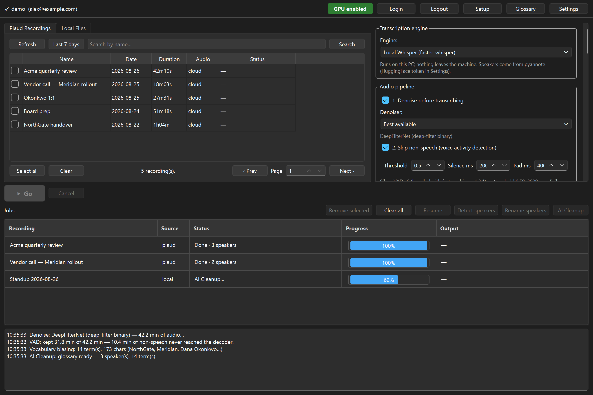
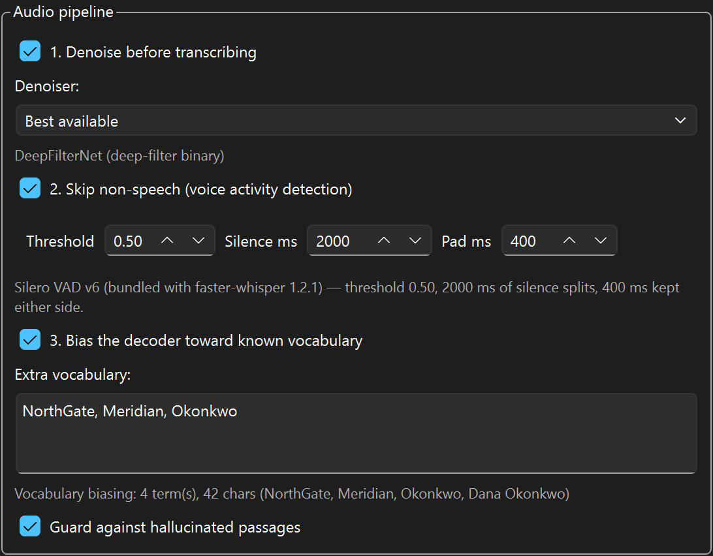
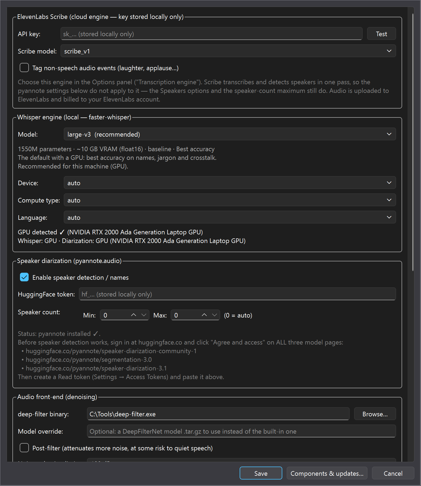
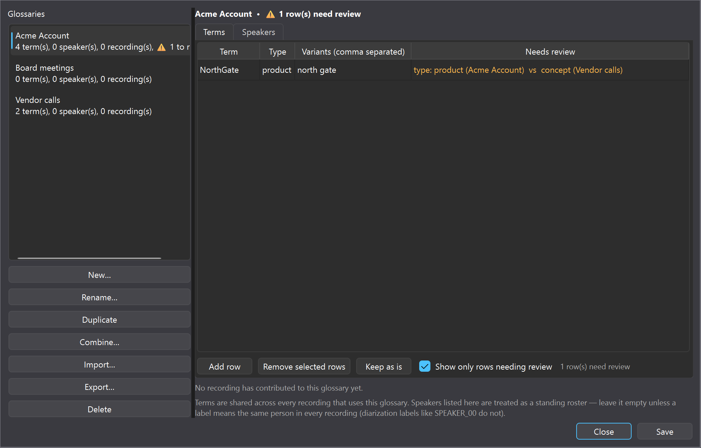
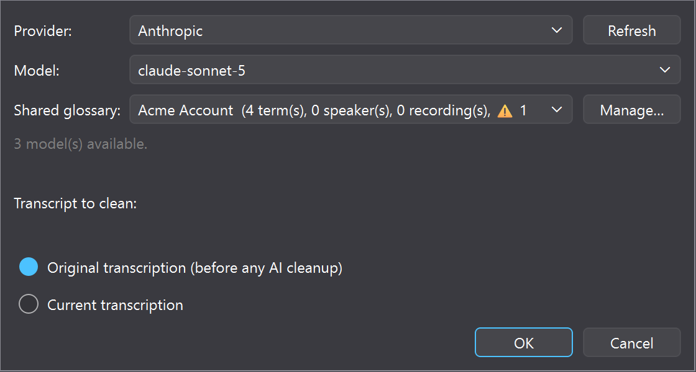
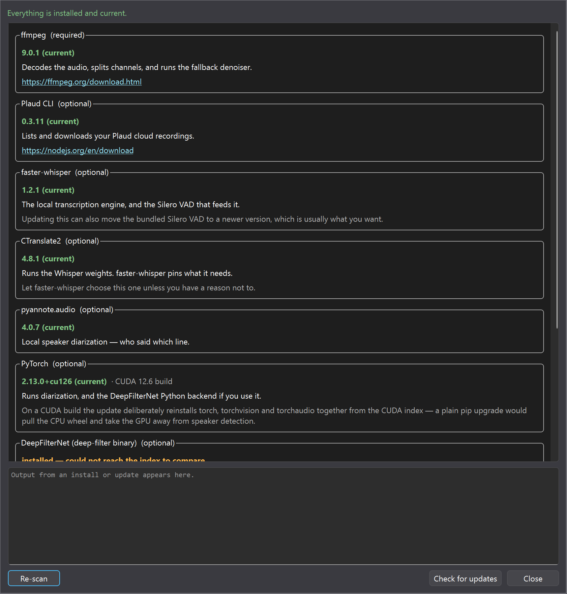

# Transcriber Studio

A desktop workbench that turns recordings into clean, speaker-labelled transcripts — on your own machine.

[](LICENSE)
[](https://www.python.org/downloads/)
[](#platform-support)
[](https://github.com/labatt/transcriber-studio/actions/workflows/tests.yml)

This started as a way to get usable transcripts out of my own [PLAUD](https://www.plaud.ai/)
recordings — meetings and calls captured on a pocket recorder, which is exactly the audio most
transcription tools handle worst. It imports straight from a PLAUD cloud account, and takes
ordinary local audio files just as happily.

Most transcription tools give you one knob: which model. On hard audio — a noisy room, a table
mic, someone talking two tables over — the model is maybe a third of the result. This app is built
around the other two thirds: **what happens to the audio before the decoder sees it**, and **what
the decoder is told to expect**.



> ⚠️ **Windows 11 is the only platform this has done real work on.** The test suite and the GUI
> both run on Ubuntu 24.04, but no actual transcription has been done there, and macOS has never
> been tried. See [Platform support](#platform-support) for the details.

> **Not affiliated with, endorsed by, or sponsored by PLAUD AI.** PLAUD is a trademark of its
> respective owner. This is an independent tool that can import from PLAUD cloud recorders using
> their public CLI, alongside ordinary local audio files.

---

## Contents

- [What it does](#what-it-does)
- [Platform support](#platform-support)
- [Requirements](#requirements)
- [GPU vs. no GPU](#gpu-vs-no-gpu)
- [Installation](#installation) — [the short way](#the-short-way) (one command) or
  [the long way](#the-long-way) (per-OS, step by step)
- [First run](#first-run)
- [Your first transcription](#your-first-transcription)
- [Getting better results on hard audio](#getting-better-results-on-hard-audio)
- [Glossaries](#glossaries)
- [Speakers and voiceprints](#speakers-and-voiceprints)
- [AI cleanup](#ai-cleanup)
- [Keeping it up to date](#keeping-it-up-to-date)
- [Transcription engines](#transcription-engines)
- [How the engines compare](#how-the-engines-compare)
- [Models](#models)
- [Where your data lives](#where-your-data-lives)
- [Troubleshooting](#troubleshooting)
- [Development](#development)
- [Licensing](#licensing)

---

## What it does

**A three-layer front end, then the model.**



1. **Denoise** — [DeepFilterNet](https://github.com/Rikorose/DeepFilterNet) cleans the signal first.
   Whisper decodes noisy speech by leaning harder on its language prior, which is exactly when it
   starts inventing fluent text that was never said. Noise suppression is the cheapest accuracy in
   the pipeline.
2. **Voice activity detection** — Silero VAD (bundled with faster-whisper) cuts silence and
   non-speech so the decoder never sees it. This removes Whisper's worst failure mode at the
   source: hallucinating a paragraph over a quiet stretch.
3. **Vocabulary biasing** — names, product names and jargon are fed to the decoder as hotwords
   before it starts guessing at them. The words come from your **shared glossary**, which fills
   itself in as jobs run: what one recording taught the app, the next one already knows.

Then a transcription engine for the words — local Whisper, **MAI-Transcribe-2** (Microsoft, via
Azure Speech), ElevenLabs Scribe, or **Gemini 3.5 Transcribe** —
[pyannote](https://github.com/pyannote/pyannote-audio) for who said them when the engine does not
do that itself, and an optional LLM pass to turn fragments into readable prose.

Every layer reports what it actually did, and says so when it fell back to something weaker —
there is no configuration that quietly does nothing.

**Also in the box**

- **Shared glossaries** — named vocabularies several jobs read from and write back to. Every time
  a term is seen again its weight goes up, and the heaviest terms are the ones that get biased
  first when the list has to be cut to fit the decoder.
- **Voiceprints** — name a speaker once and tick *Remember this voice*; later recordings come back
  with the name instead of `Speaker 2`. Works with every engine whose speakers come from pyannote
  (local Whisper and MAI). Managed from the **Speakers** button in the header.
- **Rename recordings on the device** — edit a PLAUD recording's name in the list and, if you opt
  in, the new name is pushed back to your PLAUD account. Output files can be renamed after the fact
  too.
- **AI cleanup** — merge fragments into sentences, fix speaker attribution, normalise terms
  against the glossary, and flag anything garbled.
- **Resume** — an interrupted job restarts from its last saved step. No re-transcription, no
  repeated model calls, no repeated spend. This covers the whole pipeline: a download continues
  from the byte it stopped at, finished denoise chunks and detected speaker turns are reused, and
  every stage can be cancelled while it runs. The transcription is banked before speaker detection
  begins, so a failure there costs you the labels, not the words. Closing the lid mid-job costs you
  the current chunk, not the job.
- **No length limit on cloud transcription** — MAI takes a 73-minute recording in one request.
  Gemini's output falls apart past the documented 30 minutes when speakers or word timings are
  asked for (the API *accepts* longer, but returns broken timestamps and looped sentences), so
  longer recordings are cut at a pause into parts of at most 30 minutes, lead-in included,
  transcribed separately and stitched back onto one timeline. Uploads show progress and are given
  a timeout sized to the file rather than a fixed one.
- **Components window** — what's installed, what's newer, and buttons to update it.
- **Output formats** — `txt`, `srt`, `vtt`, `json`, `md`, with a filename template builder.

---

## Platform support

| | Status |
| --- | --- |
| **Windows 10/11** | **Used daily.** Where it is developed, and the only place real recordings have gone through it. |
| **Ubuntu 24.04** | **Runs.** Full test suite passes, and the GUI has been launched and rendered under Wayland (WSL2/WSLg). No transcription has actually been run, and no NVIDIA GPU was exercised. |
| macOS | **Never tried.** Nothing in the code should stop it, and there is no CUDA there — Whisper would be CPU-only, since CTranslate2 has no Metal backend. |

What is genuinely Windows-specific, all of it guarded so nothing crashes elsewhere:

- **PATH refresh from the registry** — a no-op off Windows, where it is not needed.
- **CUDA DLL directory registration** — a no-op off Windows.
- **"Run as administrator"** — Windows only. Elsewhere the app shows you the command to run with
  `sudo` rather than shipping a privilege-escalation path nobody has tested.
- **The `deep-filter` install instructions** name the release asset generically; pick the one for
  your platform.

Package installs are platform-aware (`winget` / `brew` / `apt-get`), and the data directory follows
each platform's convention — `%APPDATA%`, `$XDG_CONFIG_HOME`, or `~/Library/Application Support`.
Running on Linux is what turned up the last two portability bugs (a queue table hardcoded to dark
colours, and three tests that only passed on Windows), so if you use it on macOS or Linux, an
issue saying what broke would be genuinely useful.

---

## Requirements

|                    | Minimum                                  | Recommended                                   |
| ------------------ | ---------------------------------------- | --------------------------------------------- |
| OS                 | Windows 10                               | Windows 11                                     |
| Python             | 3.10                                     | 3.12 or 3.13                                   |
| RAM                | 8 GB                                     | 16 GB+                                         |
| Disk               | ~3 GB (small model + deps)               | ~15 GB (large-v3 + CUDA PyTorch)               |
| GPU                | none — CPU works                         | NVIDIA, 8 GB+ VRAM, driver 525+                |
| Required tool      | [ffmpeg](https://ffmpeg.org) on PATH     | + the `deep-filter` binary                     |

Nothing here needs a GPU, and nothing here needs an internet connection once the models are
downloaded — unless you deliberately choose a cloud engine or the LLM cleanup pass.

---

## GPU vs. no GPU

This is the decision that shapes everything else, so here it is plainly.

### With an NVIDIA GPU

Whisper `large-v3` runs several times faster than real time, and speaker detection runs on the GPU
too. This is the configuration the app is tuned for.

- **VRAM decides which model fits:** `large-v3` wants ~10 GB in float16, `medium` ~5 GB, `small`
  ~2 GB. With 8 GB you can usually still run `large-v3` if nothing else is on the card; the app
  falls back to CPU automatically if the GPU load fails, and says so in the log.
- **PyTorch must be a CUDA build.** `pip install torch` gives you the CPU one, and everything will
  appear to work while speaker detection crawls. See [step 5](#5-pytorch-for-a-gpu-optional).
- **CUDA 12 is deliberately preferred over CUDA 13,** because CTranslate2 — the engine that
  actually runs Whisper — is built against CUDA 12 and cuDNN 9.
- **Whisper and diarization are separate stacks.** Whisper runs on CTranslate2, diarization on
  PyTorch. It is entirely possible for one to be on the GPU and the other not, so Settings reports
  each device independently.

### Without a GPU

Everything still works. Five honest options:

1. **Local Whisper on CPU** — use `small` (the app recommends it automatically). Expect roughly
   real time to a few times slower: an hour of audio in one to three hours. `large-v3` on CPU is
   possible but usually not worth the wait.
2. **MAI-Transcribe-2** — the most accurate engine in [our benchmark](#how-the-engines-compare),
   transcribing a whole recording in one request. Speakers still come from pyannote on your
   machine, which is the slow part on CPU.
3. **Gemini 3.5 Transcribe** — a cloud engine that transcribes *and* separates speakers in one
   pass, using the same Google AI key as AI Cleanup. See [the engines](#transcription-engines).
4. **ElevenLabs Scribe** — the same idea with a different provider and its own key. The fastest
   of the four by a wide margin.
5. **Skip diarization** — it is the most expensive part on CPU. If you only need the words, turn
   speaker detection off.

The cloud engines mean no local compute, and Gemini and Scribe need no HuggingFace token either,
but they cost money and the audio leaves your machine.

The denoise and VAD layers are cheap on CPU either way. If you only take one thing from this
README: **on hard audio, denoise + VAD + biasing on `small` beats `large-v3` on the raw file.**

---

## Installation

### The short way

Clone the repository and run the installer. It works out which OS you are on, checks what is
already installed and at what version, installs or upgrades only what is missing, and tells you
about anything it could not do.

**Windows** (PowerShell):

```powershell
git clone https://github.com/labatt/transcriber-studio.git
cd transcriber-studio
.\install.ps1
```

**macOS and Linux**:

```bash
git clone https://github.com/labatt/transcriber-studio.git
cd transcriber-studio
./install.sh
```

It asks before each step and shows the exact command first, so nothing happens that you have not
seen. Useful flags — they pass through to `install.py`, which you can also run directly if Python
is already installed:

| Flag | What it does |
| --- | --- |
| `--check` | Report what is installed and what is out of date. Changes nothing. |
| `--dry-run` | Print every command it would run, without running any of them. |
| `--yes` | Answer yes to everything, for a scripted setup. |
| `--minimal` | Only what the app cannot run without. |
| `--no-gpu` | Skip the CUDA PyTorch install even if a GPU is present. |

The shell wrappers exist for one reason: `install.py` cannot install the Python it is running on.
They find a suitable Python, install one if there is none, and hand over. Everything after that is
the same script on all three platforms.

What it handles: Python, ffmpeg (installing or upgrading), the app and its dependencies, the CUDA
build of PyTorch on the right channel for your driver, pyannote, the DeepFilterNet binary for your
platform, and the PLAUD CLI. Where there is no package manager, it downloads what it needs
directly — on Windows with no winget, that means fetching a static ffmpeg build and putting it on
your PATH.

### The long way

If you would rather do it by hand, or the installer could not finish a step, here is the same
thing manually. Steps 1–3 are required; the rest are worth doing.

#### 1. Python 3.10 or newer

| | |
| --- | --- |
| **Windows** | `winget install Python.Python.3.13` — or [python.org](https://www.python.org/downloads/), ticking *Add python.exe to PATH* |
| **macOS** | `brew install python@3.13` — or [python.org](https://www.python.org/downloads/) |
| **Debian/Ubuntu** | `sudo apt install python3 python3-venv python3-pip` |
| **Fedora** | `sudo dnf install python3 python3-pip` |
| **Arch** | `sudo pacman -S python python-pip` |

Check it: `python --version` (Windows) or `python3 --version`.

> On Debian and Ubuntu, `python3-venv` is a separate package and its absence only shows up later
> as a confusing pip error. Install it now.

#### 2. The app

```bash
git clone https://github.com/labatt/transcriber-studio.git
cd transcriber-studio

python -m venv .venv                  # python3 on macOS/Linux
.venv\Scripts\Activate.ps1            # Windows PowerShell
# .venv\Scripts\activate.bat          # Windows cmd.exe
# source .venv/bin/activate           # macOS/Linux

pip install -e ".[local]"
```

`[local]` brings in the local Whisper engine. Leave it off if you only intend to use ElevenLabs
Scribe. Then `python run.py`. An installed copy also gets a `transcriber-studio` command, so you
can make a shortcut to it.

#### 3. ffmpeg (required)

Everything decodes through ffmpeg, and it is also the fallback denoiser.

| | |
| --- | --- |
| **Windows** | `winget install Gyan.FFmpeg` — then **open a new terminal**, because winget edits PATH in the registry, not in your current session |
| **macOS** | `brew install ffmpeg` |
| **Debian/Ubuntu** | `sudo apt install ffmpeg` |
| **Fedora** | `sudo dnf install ffmpeg` |
| **Arch** | `sudo pacman -S ffmpeg` |

Check it: `ffmpeg -version`.

#### 4. The denoiser (recommended)

The single biggest accuracy win on difficult audio.

1. Go to the [DeepFilterNet releases page](https://github.com/Rikorose/DeepFilterNet/releases/latest).
2. Download the asset for your platform (~27 MB, no installer):

   | | |
   | --- | --- |
   | Windows | `deep-filter-<version>-x86_64-pc-windows-msvc.exe` |
   | macOS (Apple silicon) | `deep-filter-<version>-aarch64-apple-darwin` |
   | macOS (Intel) | `deep-filter-<version>-x86_64-apple-darwin` |
   | Linux (x86-64) | `deep-filter-<version>-x86_64-unknown-linux-musl` |
   | Linux (ARM64) | `deep-filter-<version>-aarch64-unknown-linux-gnu` |

3. Put it somewhere permanent — on macOS and Linux, `chmod +x` it — then either put its folder on
   your PATH under the name `deep-filter`, or point **Settings → Audio front-end → deep-filter
   binary** at it.

> **Why not `pip install deepfilternet`?** The package depends on `deepfilterlib`, which has no
> wheels past Python 3.11 and fails to build from source on newer Pythons. The standalone binary is
> the same model and does not care which Python you run. With neither installed the app falls back
> to ffmpeg's own `afftdn` denoiser — real, but clearly weaker on background chatter, and the UI
> says so rather than pretending otherwise.

#### 5. PyTorch for a GPU (optional)

Skip this if you have no NVIDIA GPU. Do it **before** step 6, and do not use a plain
`pip install torch` — that installs the CPU build.

Check what your driver supports with `nvidia-smi`; the top-right "CUDA Version" is the *highest* it
supports, and anything at or below works. Then install the matched set:

```bash
pip install torch torchvision torchaudio torchcodec --index-url https://download.pytorch.org/whl/cu126
```

Verify: `python -c "import torch; print(torch.__version__, torch.cuda.is_available())"` — you want
`True`.

**CUDA 12 is deliberately preferred over CUDA 13**, because CTranslate2 — the engine that actually
runs Whisper — is built against CUDA 12 and cuDNN 9. If PyTorch releases a version the `cu126`
channel has stopped publishing, the Components window works out which channel actually has it.

There is no CUDA on macOS, and CTranslate2 has no Metal backend, so Whisper is CPU-only there.

#### 6. Speaker diarization (optional)

```bash
pip install -e ".[diarization]"
```

Then two things no installer can do for you:

1. **Accept the model licences.** Sign in at [huggingface.co](https://huggingface.co) and click
   *Agree and access* on all three:
   - [pyannote/speaker-diarization-community-1](https://huggingface.co/pyannote/speaker-diarization-community-1)
   - [pyannote/segmentation-3.0](https://huggingface.co/pyannote/segmentation-3.0)
   - [pyannote/speaker-diarization-3.1](https://huggingface.co/pyannote/speaker-diarization-3.1)
2. **Create a token.** HuggingFace → Settings → Access Tokens → a **Read** token. Paste it into the
   setup wizard or Settings. Its **Test** button checks the token *and* all three licences, and
   tells you which one you missed.

#### 7. PLAUD cloud import (optional)

Only needed to pull recordings from a PLAUD account; local files work without it.

| | |
| --- | --- |
| **Windows** | `winget install OpenJS.NodeJS.LTS` |
| **macOS** | `brew install node` |
| **Debian/Ubuntu** | `sudo apt install nodejs npm` (check `node --version` is 20+; if not, use [nodesource](https://github.com/nodesource/distributions)) |

Then `npm install -g @plaud-ai/cli`. Sign in once — the wizard's PLAUD page does it for you. The
CLI holds the token, not this app.

PLAUD's public API is read-only. Renaming a recording from inside the app and having the new name
appear in your PLAUD account uses PLAUD's own web interface instead, and is off unless you turn it
on in Settings → PLAUD rename and paste a web session token there. Without it, renames stay local
to the app and are marked as not yet pushed.

---

## First run

A setup wizard walks through the engine, the model and the service keys, and tells you what is
still missing.



Two settings worth doing straight away:

- **Options → Output → Your name(s).** Output files are named after the *other* person on a
  recording, so the app has to know which speaker is you. List every spelling you get labelled
  with: `Alex Rivera, Alex R, Alex`. Leave it empty and the first named speaker is used instead.
- **Settings → AI Cleanup defaults.** Set a provider and model once, and every job starts from it
  instead of asking each time.

---

## Your first transcription

1. **Pick a source.** *Local Files* → add a file, or *PLAUD Recordings* → Refresh, then tick one.
2. **Check the Options panel** on the right: engine, output formats, output folder.
3. **Turn on the pipeline** (Audio pipeline group): denoise, VAD, biasing. All three are cheap.
4. **Press Go.** The log reports each layer as it runs — which denoiser, how much non-speech the
   VAD removed, how many vocabulary terms went in, which model and which device.
5. **When it finishes**, the Output column has buttons to open the folder and to rename the
   files. If speakers were detected, a rename dialog offers to put real names on them — that is
   what feeds the filename and the glossary — and a *Remember this voice* box next to each name
   enrols that speaker so the next recording can name them on its own.

Nothing is written until a job completes, so cancelling leaves no half-made transcript.

---

## Getting better results on hard audio

In rough order of how much they buy you:

1. **Turn on denoising** with the `deep-filter` binary installed. Biggest single win.
2. **Turn on VAD.** Also the fix if you are seeing invented text over quiet passages.
3. **Point the job at a shared glossary** and let it accumulate. By the third recording from the
   same account it knows the names.
4. **Add anything you know in advance** to Options → Audio pipeline → Extra vocabulary.
5. **Leave the hallucination guard on** unless you have a reason not to.
6. **Only then reach for a bigger model.**
7. **If the transcript needs to be verbatim** — disfluencies and all — use CrisperWhisper and let
   AI Cleanup do the tidying afterwards.
8. **If suppression sounds like it is eating consonants**, lower Settings → Audio front-end →
   Noise reduction limit from 100 dB.

---

## Glossaries

A shared glossary is a named vocabulary that several jobs read from and write back to. Point every
recording from the same account at one and the vocabulary compounds instead of being re-learned.



Open it from the **Glossary** button in the header. You can create, rename, duplicate, delete,
**import** a glossary file into the open one, and **combine** several into one. Merges dedupe:
the same term from two sources becomes one entry with the variant spellings pooled.

Where two sources disagree — the same term with a different type, the same speaker label with a
different name — the entry is **kept and tagged** rather than one reading being picked silently.
The tables filter down to just those rows, and each one has three ways out: edit the cell they
disagreed about, delete the row, or press **Keep as is**.

One deliberate asymmetry: terms are shared, the speaker roster is not. A diarization label like
`SPEAKER_00` means a different person in every recording, so sharing rosters would mislabel the
next job. Names that a roster *did* resolve travel across as `person` terms instead — and the
people themselves travel as [voiceprints](#speakers-and-voiceprints).

---

## Speakers and voiceprints

pyannote returns a voice embedding for every speaker it separates. The app keeps those. Name a
speaker in the rename dialog, tick **Remember this voice**, and the embedding is stored as a
voiceprint under that name. On the next recording, each detected speaker is compared with every
enrolled voice; a close enough match (and a clear enough margin over the runner-up) puts the name
on the transcript before you have looked at it.

The **Speakers** button in the header opens the management dialog:

- **Enrolled voices** — who is enrolled, how many samples each has, rename or forget a person, or
  drop a single bad sample.
- **Recognition** — the match threshold, the margin, and the minimum speech a speaker needs before
  a match is attempted; plus a log of every match decision the app has made, with a suggestion for
  where to set the threshold based on the scores it has seen.

Voiceprints work with every engine whose speakers come from pyannote — local Whisper and MAI.
ElevenLabs Scribe and Gemini separate speakers themselves and return no voice data, so on those
engines speakers stay numbered per recording.

---

## AI cleanup

An optional pass that turns segmenter fragments into readable prose: merges sentences, fixes
speaker attribution, normalises terms against the glossary, strips filler, and flags anything
garbled rather than guessing.



Works with OpenRouter, OpenAI, Anthropic, Google, xAI, and Ollama (cloud or local). Keys go in
Settings and are only ever sent to the provider they belong to. Prompt caching is used where the
provider supports it, and an interrupted run resumes without paying for the same calls twice.

---

## Keeping it up to date

**Settings → Components & updates** reports what is installed against the current releases and can
install or update any of it. It checks PyPI, npm and GitHub as soon as it opens.



Every command is shown in full and confirmed before it runs, so you can always copy it and run it
yourself instead. Three things it handles that a plain `pip install --upgrade` gets wrong:

- **PyTorch** is upgraded as a matched set (torch, torchvision, torchaudio, torchcodec) from a CUDA
  channel that actually publishes the target release — pinning the channel you are on silently
  does nothing once PyTorch retires it.
- **PATH** is re-read from the registry after an install, because a winget upgrade moves ffmpeg into
  a new version-stamped folder and the old one stops existing.
- **Permissions** — if an install is refused for lack of rights, it offers a user-scope install or
  an elevated re-run rather than just failing.

---

## Transcription engines

Chosen per run in the Options panel.

| | Runs where | Speakers | Vocabulary hints | Needs |
| --- | --- | --- | --- | --- |
| **Local Whisper** | your machine | pyannote, separately | hotwords, every window | faster-whisper; a HuggingFace token for speakers |
| **MAI-Transcribe-2** | Azure | pyannote, separately (see below) | phrase list, 50 terms | an Azure Speech key in one of six regions; a HuggingFace token for speakers |
| **Gemini 3.5 Transcribe** | Google | in the same pass | none — the API refuses them alongside speakers or timestamps | a Google AI key — the same one AI Cleanup uses |
| **ElevenLabs Scribe** | ElevenLabs | in the same pass | none | an ElevenLabs key |

Only the local engine gets the full [audio pipeline](#what-it-does) in front of it. Denoising
still applies to every engine — the enhanced audio is what gets uploaded — and the shared glossary
reaches the two engines that take hints. VAD is decoder-side and stays local. Picking MAI turns
denoising off for that run and says so: its own front end handles noisy audio, and the file goes
up untouched.

### MAI-Transcribe-2

Microsoft's speech model, in public preview through Azure Speech's fast transcription endpoint.
You need an Azure account and a Speech (or Foundry) resource in one of the regions that host the
model — eastus, westus, westus2, northeurope, southeastasia or centralindia — and its key and
region go into Settings. The **Test** button there checks both.

It transcribes a whole recording in one request (a 73-minute, 70 MB file went up without
splitting) and returns word timings. Two of its options matter:

- **Verbatim, not clean.** The *clean* style removes real words, not just fillers — in our
  benchmark it cost 2 to 5 points of word error rate on every recording. Use verbatim and let AI
  Cleanup do the tidying, where you can see what changed.
- **Speakers are detected here, not there.** MAI's own diarization fails on anything much past 15
  minutes with errors that look like network timeouts (see
  [docs/mai-transcribe-diarization-issue.md](docs/mai-transcribe-diarization-issue.md), reported
  to Microsoft). So by default the app uses MAI for the words and pyannote for the speakers,
  which also means voiceprints work. The setting is there if you want MAI's own diarization on a
  short clip.

The phrase list it accepts as vocabulary hints is capped at 50 entries, which the documentation
does not mention; the app sends the 50 heaviest glossary terms and logs how many were left out.

### Gemini 3.5 Transcribe

Two modes, and they are not two flavours of the same thing:

| Mode | What you get |
| --- | --- |
| **Verbatim** (default) | Speaker labels and word-level timestamps, every word as spoken — fillers included. The only mode that fills in this app's data model, so subtitles and per-line times work. |
| **Smart** | One block of punctuated, capitalised prose. **No speaker labels and no timestamps** — the API rejects both parameters in this mode, so `.srt` and `.vtt` come out with zero timings. |

Verbatim plus AI Cleanup is the pairing to use: get every word down, then tidy. The app warns in
the job log if you pick smart while speaker detection is on.

Two more constraints worth knowing, both found by asking the API rather than reading the docs:

- **Vocabulary biasing is unavailable here.** Google's `custom_vocabulary` is rejected outright
  alongside either diarization or timestamps, and this app needs both. Terms are not silently
  dropped — the Options panel says so where the setting lives.
- **Length limits are real even where the API does not enforce them.** Google documents *"Audio
  processing is limited to 30 minutes when features like speaker diarization or word-level
  timestamps are enabled"*. The API accepts requests up to about 54 minutes anyway — and past 30
  it returns word timings out of order, starts hours beyond the end of the file, and sentences
  repeated dozens of times. Scored against reference transcripts, that was the difference between
  38 percent and 8 percent word error rate on the same call. So verbatim-mode recordings over 30
  minutes are cut into parts of at most 30 minutes including the 3-minute lead-in used to match
  speakers across the join, and any stray timings or decoding loops that remain are repaired and
  logged. Splitting has a cost of its own: a voice not heard on both sides of a join becomes an
  extra speaker.

---

## How the engines compare

All four engines were run through this app against five public recordings with human reference
transcripts — two [AMI Meeting Corpus](https://groups.inf.ed.ac.uk/ami/corpus/) meetings (one of
them on both a table mic and headsets) and two [Earnings-22](https://github.com/revdotcom/speech-datasets)
earnings calls — and scored on word error rate, proper-noun recall, speaker attribution and
diarization error rate.

| Recording | MAI verbatim | Scribe | Gemini | Whisper large-v3 |
| --- | --- | --- | --- | --- |
| AMI meeting, table mic, 39 min | **13.7%** | 14.9% | 17.3% | 23.0% |
| Same meeting, headset mics | **11.8%** | 12.6% | 15.0% | 19.8% |
| AMI meeting with heavy overlap, 36 min | **26.4%** | 27.4% | 33.4% | 39.3% |
| Costco earnings call, 66 min | **6.9%** | 7.0% | 7.8% | 11.3% |
| UK earnings call, 61 min | **8.0%** | 8.2% | 8.5% | 10.1% |

Word error rate, lower is better, after the same normaliser the Open ASR Leaderboard uses. MAI
was lowest on every recording; Scribe was within a point everywhere and had the best proper-noun
recall on every file; Whisper's gap on meetings is dropped speech in overlapping stretches, and the
`turbo` model scores the same as the full one. Full tables, method, and everything that broke on
the way: [docs/engine-benchmark-results.md](docs/engine-benchmark-results.md),
[docs/benchmark-issues-log.md](docs/benchmark-issues-log.md), and the write-up in
[docs/article-stt-engine-benchmark.md](docs/article-stt-engine-benchmark.md). The tooling is in
`tools/` and runs against any recording with a reference transcript.

---

## Models

| Model | Parameters | VRAM (fp16) | Speed | Accuracy |
| --- | --- | --- | --- | --- |
| `tiny` | 39M | ~1 GB | ~10× faster | Roughest |
| `base` | 74M | ~1 GB | ~7× faster | Rough |
| `small` | 244M | ~2 GB | ~4× faster | Decent |
| `medium` | 769M | ~5 GB | ~2× faster | Good |
| `large-v2` | 1550M | ~10 GB | baseline | Excellent |
| `large-v3` | 1550M | ~10 GB | baseline | Best |
| `large-v3-turbo` | 809M | less than `large-v3` | ~6× faster | Best, or near it — see below |
| **CrisperWhisper** | 1550M | ~10 GB | about the same | Best (verbatim) |

Speed is relative to `large-v3` on the same machine. Models download from HuggingFace on first use.

`large-v3-turbo` keeps the full encoder and cuts the decoder from 32 layers to four. In
[our benchmark](#how-the-engines-compare) it scored within two points of `large-v3` on every
recording and produced the same word counts, so on this app's pipeline it is the default worth
having. The one place the smaller decoder shows is vocabulary biasing: hotwords act in the decoder,
so there is less for them to work with.

**[CrisperWhisper](https://huggingface.co/nyralabs/CrisperWhisper)** is a `large-v3` fine-tune that
transcribes *verbatim* — it keeps the fillers, stutters and false starts stock Whisper quietly tidies
away, and it hallucinates less over noise. Pair it with AI Cleanup, which is where tidying belongs:
after the words are on the page. Three caveats, all shown in the app:

- **English and German only.** The fine-tune was trained on those two.
- **Word timestamps are less precise** than the original — this is the CTranslate2 conversion,
  which computes them differently. Segment times are unaffected.
- ⚠️ **The weights are CC-BY-NC-4.0 — non-commercial.** Every other model here is MIT. If you are
  transcribing for commercial purposes, use `large-v3` instead. See [Licensing](#licensing).

---

## Where your data lives

Everything is local. On Windows, `%APPDATA%\TranscriberStudio`; on Linux
`~/.config/transcriber-studio`; on macOS `~/Library/Application Support/TranscriberStudio`.

```
settings.json      your settings and API keys, in plain text
queue.json         the job queue, so it survives a restart
history.json       what was processed and when
plaud_names.json   names you gave PLAUD recordings, and whether each was pushed to PLAUD
glossaries/        the shared glossary library
voiceprints/       enrolled voices (one JSON file of embeddings per person) and the match log
audio_cache/       downloaded PLAUD audio
denoise_cache/     enhanced audio, so a re-run does not redo it
diarization_cache/ detected speaker turns and voice embeddings, so a re-run does not redo them
resume/            checkpoints for interrupted jobs
```

Transcripts go wherever you point the output folder — never into the app directory.

**What leaves your machine:** nothing, unless you turn it on. Local Whisper, DeepFilterNet, VAD,
pyannote and voiceprint matching all run on your hardware. Audio is uploaded only if you choose a
cloud engine — MAI (Azure), Gemini (Google) or Scribe (ElevenLabs) — and only to that provider.
Transcript text is sent to an LLM provider only if you enable AI Cleanup, and only to the provider
you picked. A recording's new name is sent to PLAUD only if you opt into pushing renames. See
[SECURITY.md](SECURITY.md) for how keys are stored.

---

## Troubleshooting

**"ffmpeg is not installed" right after I installed it.** Windows hands each process a copy of the
environment at launch, and installers only edit the registry — so a running app cannot see a new
PATH. Worse, winget installs ffmpeg into a version-stamped folder, so an *upgrade* deletes the
directory the app started with. The app re-reads PATH from the registry on startup, after any
install, and on every component scan; if it still cannot find it, restart the app.

**Speaker detection is very slow.** PyTorch is probably the CPU build. Settings reports
"Diarization: CPU" when this is the case; reinstall it per [step 5](#5-pytorch-for-a-gpu-optional).

**Diarization fails with a licence or token error.** All three model pages need *Agree and access*,
not just the first. The Test button next to the token says which one is missing.

**Whisper hallucinated a paragraph that was never said.** Turn on VAD and the hallucination guard,
and denoise the input. That combination exists specifically for this failure.

**A transcript keeps mangling the same name.** Put it in a shared glossary and point the job at it.
Or type it into Options → Audio pipeline → Extra vocabulary for a one-off.

**GPU load failed / cuBLAS or cuDNN errors.** The app falls back to CPU and says so in the log.
Usually a CUDA/PyTorch mismatch — check the Components window.

**An update seemed to succeed but the version did not change.** Almost always PyTorch on a retired
CUDA channel. The Components window picks a channel that has the release; a hand-written
`--index-url` may not.

**MAI returns 408 "Timeout", 500 or 503 on a long recording.** That is MAI's own speaker
diarization failing, not your network: the same file goes through with diarization off. Leave
*Speakers* set to *local* in the MAI settings, which is the default, and pyannote does the
separating.

**MAI rejects the request with "Context list cannot have more than 50 items".** The phrase list is
capped at 50. The app trims to 50 and logs it; if you see this, the app is out of date.

**Gemini repeated a sentence dozens of times, or the timeline is nonsense.** A request went over
30 minutes with speakers or timestamps on. Current versions split at 30 minutes and repair what is
left; if you see it, update.

**A PLAUD rename did not reach the device.** Pushing names to PLAUD is opt-in and uses a web
session token that expires; Settings → PLAUD rename shows whether the token is still good, and
the name stays in the app either way until it can be pushed.

---

## Development

```powershell
pip install -e ".[local,dev]"
pytest                 # ~600 tests, no GPU, network or API keys needed
python -m ruff check .
```

Tests run headless and never touch your real settings, glossaries or caches — see
`tests/support.py` for the isolation helpers. If you add state that lives in the app directory, add
an isolation helper for it too.

The engine benchmark lives in `tools/`: `engine_bench.py` runs every configured engine over a set
of recordings through the app's own transcribe path, and `bench_refs.py` builds reference
transcripts from AMI (NXT) or Earnings-22 (`.nlp`) annotations and scores against them. Both are
documented in their module docstrings; results and method notes are under `docs/`.

Screenshots in this README are generated from mocked-up data, never from a real install:

```powershell
python docs/make_screenshots.py
```

Contributions welcome — see [CONTRIBUTING.md](CONTRIBUTING.md).

---

## Licensing

Transcriber Studio is **GPL-3.0-or-later**. See [LICENSE](LICENSE).

Third-party components keep their own licences, and two are worth knowing about:

| Component | Licence | Note |
| --- | --- | --- |
| PySide6 / Qt | LGPL-3.0 | Fine for this source release. If you ever ship a **bundled binary**, LGPL obligations apply — ship the Qt libraries as separate shared libraries and include their licence. |
| CrisperWhisper weights | CC-BY-NC-4.0 | **Non-commercial only.** An optional model, not a dependency. |
| faster-whisper, CTranslate2, pyannote.audio, onnxruntime | MIT | |
| PyTorch | BSD-3-Clause | |
| DeepFilterNet | MIT / Apache-2.0 | |
| OpenAI Whisper weights | MIT | |
| pyannote models | gated | Free, but you must accept the terms on HuggingFace. |

This is a summary offered in good faith, not legal advice. If you plan to redistribute or use this
commercially, read the licences yourself.
